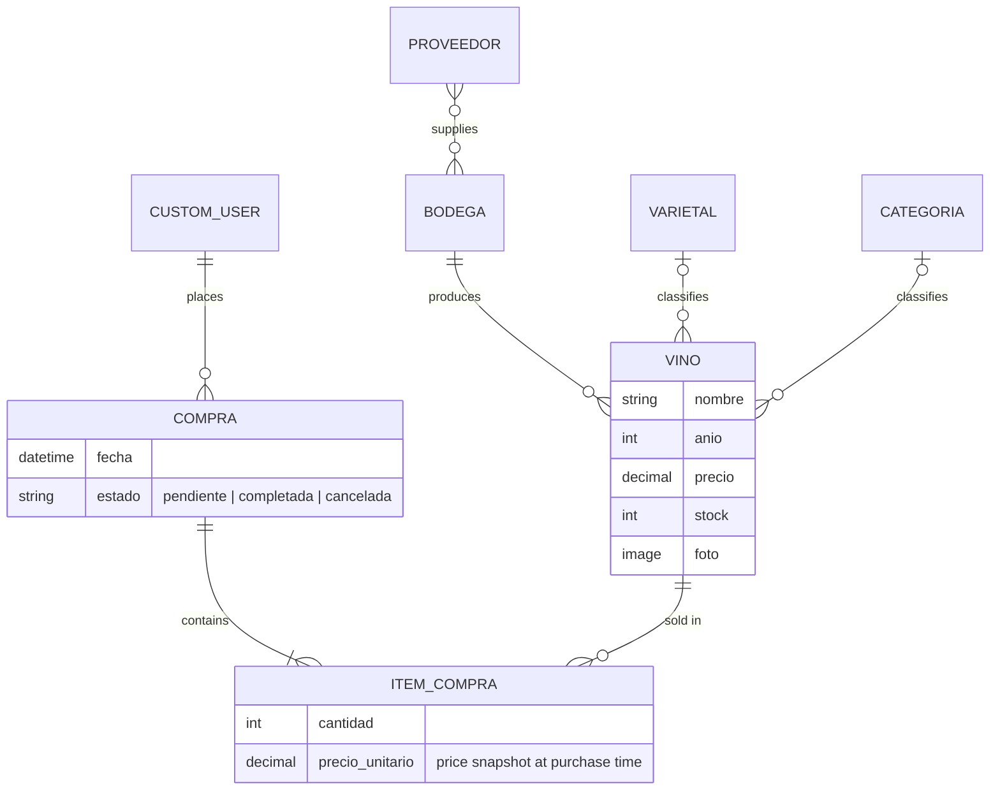

# vinoteca-django

A web app for running a wine shop: catalog of wines and wineries, customer purchases with stock control, and role-based access for admins and employees.


> 🇪🇸 The original Spanish documentation (university assignment) is in [README.es.md](README.es.md).

## Features
- **Wine and winery catalog** with full CRUD, photos and logos (image uploads), plus forms to add grape varieties and categories.
- **Purchases**: logged-in users buy a wine, stock is checked and decremented, and each user sees their purchase history with totals.
- **Role-based access** with two groups, `Administradores` and `Empleados`, created automatically by a data migration.
- **Permission-aware UI**: create/edit/delete buttons only render if the user has the matching permission; the views also enforce it (403 otherwise).
- **Custom user model** with photo, phone and address; sign up logs the user in automatically.
- **Django admin** configured with filters, search and ordering for every model.
- **Global context processor** that feeds the shop name, featured wines and the user's recent purchases to every template.

## Tech stack
Python · Django 6 · SQLite · Tailwind CSS · Pillow · python-dotenv

## Data model



## Roles and permissions

| Action | Anonymous | Registered user | Empleados | Administradores |
|---|---|---|---|---|
| See home page | ✅ | ✅ | ✅ | ✅ |
| List / view wines and wineries | ❌ | ✅ | ✅ | ✅ |
| Make a purchase, see own purchases | ❌ | ✅ | ✅ | ✅ |
| Add wines | ❌ | ❌ | ✅ | ✅ |
| Edit / delete wines | ❌ | ❌ | ❌ | ✅ |
| Add / edit / delete wineries | ❌ | ❌ | ❌ | ✅ |

The same winery list seen by an employee (left) and an admin (right), who also gets the "Nueva bodega" button:

| Employee | Admin |
|---|---|
|  |  |

## Main routes
This is a server-rendered app (Django templates), so these are HTML views, not a JSON API.

| Method | Route | Description | Access |
|---|---|---|---|
| GET/POST | `/accounts/register/` | Sign up (auto-login on success) | Public |
| GET/POST | `/accounts/login/` | Log in | Public |
| GET | `/vinos/` | List wines | Logged in |
| GET | `/vinos/<id>/` | Wine detail | Logged in |
| GET/POST | `/vinos/crear/` | Create a wine | `add_vino` |
| GET/POST | `/vinos/editar/<id>/` | Edit a wine | `change_vino` |
| GET/POST | `/bodegas/crear/` | Create a winery | `add_bodega` |
| GET/POST | `/compras/crear/` | Buy a wine (checks and decrements stock) | Logged in |
| GET | `/mis-compras/` | Current user's purchases with totals | Logged in |
| GET | `/admin/` | Django admin | Staff |

## Run locally
```bash
git clone https://github.com/ValenBelone7/vinoteca-django.git
cd vinoteca-django
python -m venv venv && source venv/bin/activate   # Windows: venv\Scripts\activate
pip install -r requirements.txt
cp .env.example .env
```

`DEBUG` and `ALLOWED_HOSTS` already have local defaults. Generate a `SECRET_KEY` and paste it into `.env` (the app won't start with it empty):

```bash
python -c "from django.core.management.utils import get_random_secret_key as g; print(g())"
```

Then:

```bash
python manage.py migrate            # also creates the Administradores and Empleados groups
python manage.py createsuperuser
python manage.py runserver
```

Open http://127.0.0.1:8000/ and the admin at http://127.0.0.1:8000/admin/. To try the roles, create users from the admin and add them to the `Empleados` or `Administradores` group.

## What I learned
- **Permissions as code, not as manual setup.** The groups and their permissions are created in a data migration (`RunPython` with a reverse function), so every fresh database gets the same roles after `migrate`, with no clicking through the admin. Access is then enforced twice: `@permission_required(..., raise_exception=True)` in the views returns a 403, and `` in the templates hides buttons the user can't use. Hiding a button is only UX; the view check is what actually protects the data.
- **Keeping purchase history correct.** `ItemCompra` stores `precio_unitario` copied from the wine at the moment of purchase instead of reading `vino.precio` later, so changing a price doesn't rewrite past purchase totals. The purchase view also validates stock before creating the item and decrements it afterwards.
- **Custom user model from day one.** `AUTH_USER_MODEL` points to a `CustomUser` extending `AbstractUser` (photo, phone, address). It has to be set before the first migration; switching later means rebuilding the auth tables.
- **Avoiding N+1 queries.** Wine lists use `select_related('bodega', 'varietal', 'categoria')` so each page runs a single query instead of one per wine.
- **Config out of the code.** `SECRET_KEY`, `DEBUG` and `ALLOWED_HOSTS` are read from a `.env` file with `python-dotenv`, and only `.env.example` is committed.

## Next steps
- Automated tests for the permission rules and the purchase/stock flow.
- Wrap the purchase in `transaction.atomic()` with `select_for_update()` so two simultaneous purchases can't oversell the same stock.
- Multi-item cart instead of one wine per purchase.

## Authors
Valentín Belone · Tiago Pescara
